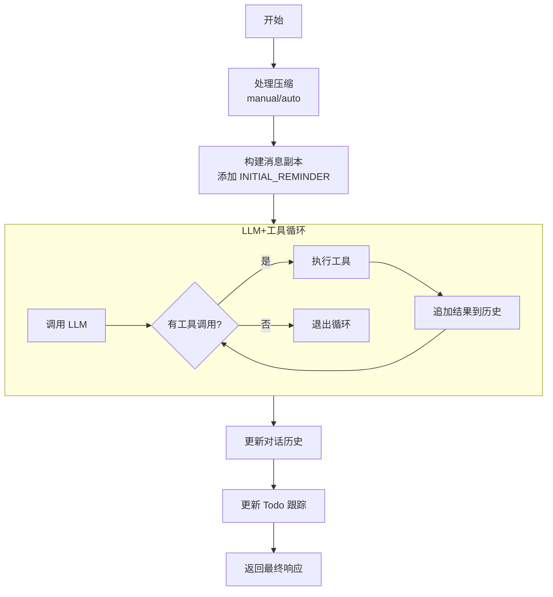
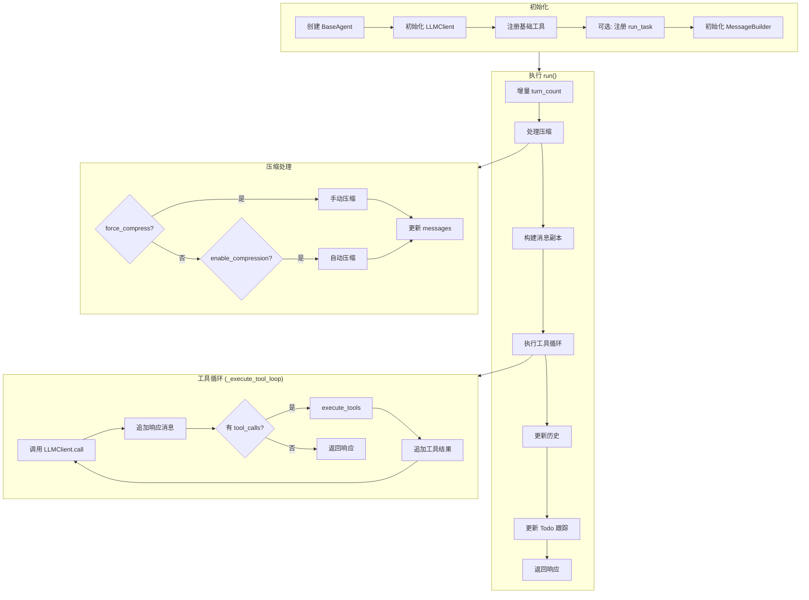
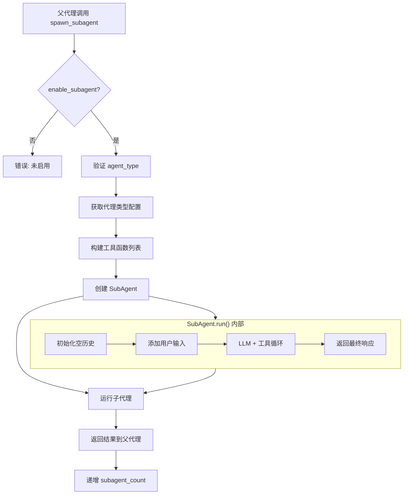
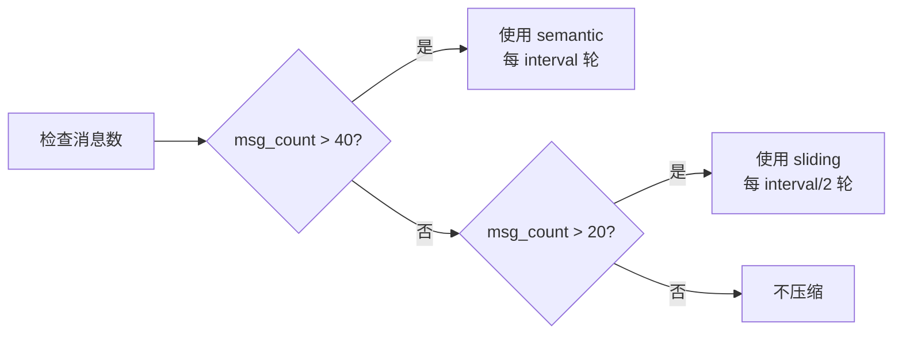
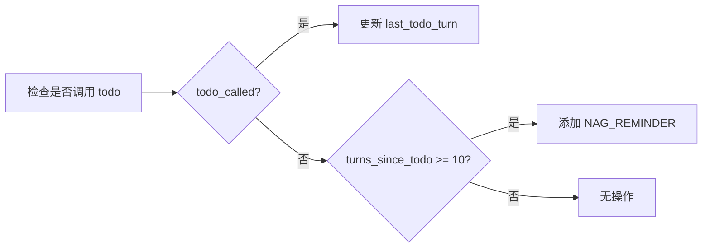

# Agent 模块文档

## 概述

Agent 模块是 `mini_agent` 框架的核心组件，提供了主代理（`BaseAgent`）和子代理（`SubAgent`）的实现。该模块负责对话管理、工具调用、历史压缩和子任务委派。

## 模块结构

```
agent/
├── core.py       # BaseAgent 主类实现
├── subagent.py   # SubAgent 子代理实现
└── __init__.py  # 模块导出
```

## 核心组件

### 1. BaseAgent

主代理类，负责处理用户交互、工具调用和历史管理。

#### 初始化参数

| 参数 | 类型 | 默认值 | 描述 |
|------|------|--------|------|
| `model` | str | `"dashscope/qwen-turbo"` | 使用的 LLM 模型 |
| `system_prompt` | str | None | 自定义系统提示词 |
| `temperature` | float | `0.0` | 采样温度（确定性输出） |
| `max_tokens` | int | None | 最大输出 token 限制 |
| `enable_compression` | bool | `False` | 启用自动历史压缩 |
| `compression_interval` | int | `20` | 自动压缩间隔轮次 |
| `compression_type` | str | `"auto"` | 压缩模式：`sliding`/`semantic`/`auto`/`none` |
| `enable_subagent` | bool | `False` | 启用子代理功能 |

#### 主要方法

##### `run(user_input: str, verbose: bool = False, force_compress: Optional[str] = None) -> str`

执行单轮交互的主入口方法。

**流程图：**



##### `reset()`

重置对话历史，仅保留系统提示词。

##### `chat(verbose: bool = False)`

交互式聊天模式，支持以下命令：
- `exit` / `quit` - 退出聊天
- `stats` - 显示压缩统计
- `reset` - 重置对话
- `verbose` - 切换详细模式

##### `register_tool(name: str | None = None)`

装饰器，用于注册自定义工具。

```python
agent = BaseAgent()

@agent.register_tool()
def my_custom_tool(data: str) -> str:
    return f"Processed: {data}"
```

### 2. SubAgent

轻量级子代理，用于执行隔离的子任务。

#### 特点

- **隔离上下文**：不访问父代理的历史记录
- **无递归**：不能生成更多子代理（防止无限递归）
- **独立工具集**：根据代理类型使用不同的工具集

#### 初始化参数

| 参数 | 类型 | 描述 |
|------|------|------|
| `model` | str | 使用的 LLM 模型（继承自父代理） |
| `tools` | List[Dict] | 工具定义列表 |
| `tool_functions` | List[Callable] | 可调用的工具函数列表 |
| `system_prompt` | str | 代理类型特定的系统提示词 |
| `temperature` | float | 采样温度（继承自父代理） |
| `max_tokens` | int | 最大 token 限制（继承自父代理） |
| `parent_logger` | Logger | 可选的父代理日志记录器 |

#### 代理类型

| 类型 | 描述 | 工具 |
|------|------|------|
| `explore` | 只读探索代理，用于搜索和分析 | `bash`, `read_file` |
| `code` | 完整功能代理，用于实际编码 | 全部工具 |
| `plan` | 规划代理，用于设计策略 | `bash`, `read_file` |

## 调用流程

### 完整的 BaseAgent.run() 流程



### 子代理生成流程



## 压缩管理

### 压缩类型

| 类型 | 策略 | 适用场景 |
|------|------|----------|
| `sliding` | 滑动窗口：仅保留最近 N 轮 | 中等长度对话 |
| `semantic` | 语义摘要：用 LLM 总结早期对话 | 长对话 |
| `auto` | 自动选择：根据消息数量选择 | 不确定场景 |
| `none` | 不压缩 | 短对话 |

### 自动压缩触发条件



## Todo 跟踪与 NAG 提醒

### NAG 提醒触发条件

当连续 10 轮以上未调用 todo 工具时，系统会自动添加 NAG 提醒消息。



## 使用示例

### 基本用法

```python
from src import BaseAgent

# 创建代理
agent = BaseAgent(model="dashscope/qwen-turbo")

# 执行单轮交互
response = agent.run("List all files in the current directory")
print(response)
```

### 启用子代理

```python
agent = BaseAgent(
    model="dashscope/qwen-turbo",
    enable_subagent=True
)

# 代理可以自动使用 run_task 工具生成子代理
response = agent.run("Analyze this codebase and suggest improvements")
```

### 交互式聊天

```python
agent = BaseAgent()
agent.chat(verbose=True)
```

### 自定义工具

```python
agent = BaseAgent()

@agent.register_tool("calculate")
def calculate(expression: str) -> str:
    """Evaluate a mathematical expression."""
    try:
        result = eval(expression)
        return str(result)
    except Exception as e:
        return f"Error: {e}"

# 获取所有已注册工具名称
print(agent.get_tool_names())
```

## 统计信息

BaseAgent 提供以下统计方法：

| 方法 | 返回值 | 描述 |
|------|--------|------|
| `get_compression_stats()` | Dict | 压缩统计（sliding_count, semantic_count） |
| `get_subagent_count()` | int | 生成的子代理数量 |
| `get_skill_count()` | int | 使用的技能数量 |
| `get_history()` | List | 当前对话历史 |
