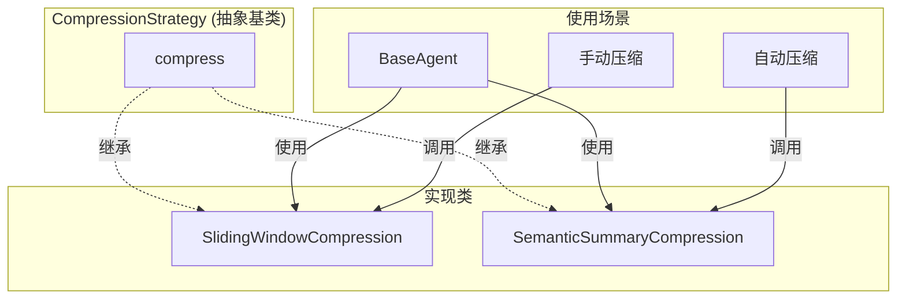
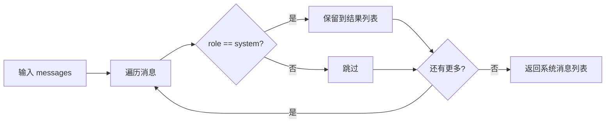
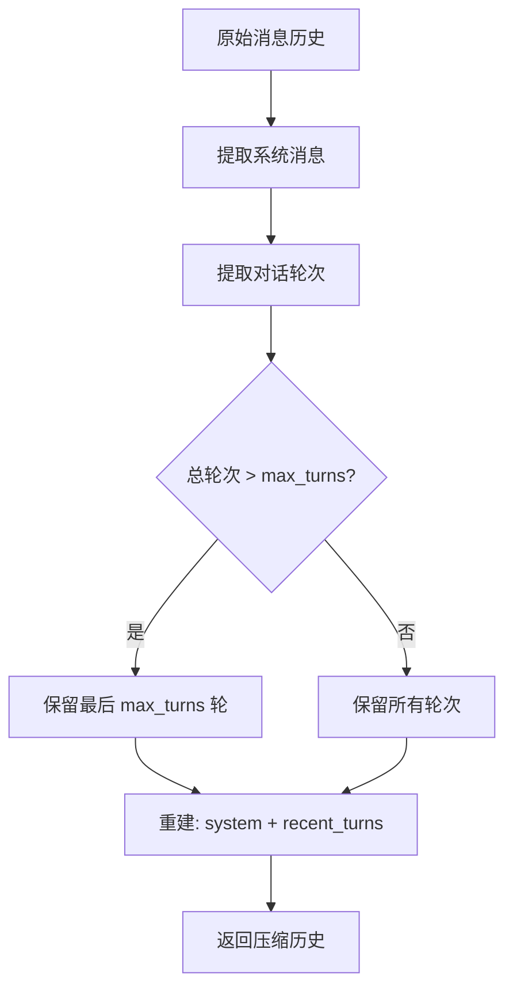
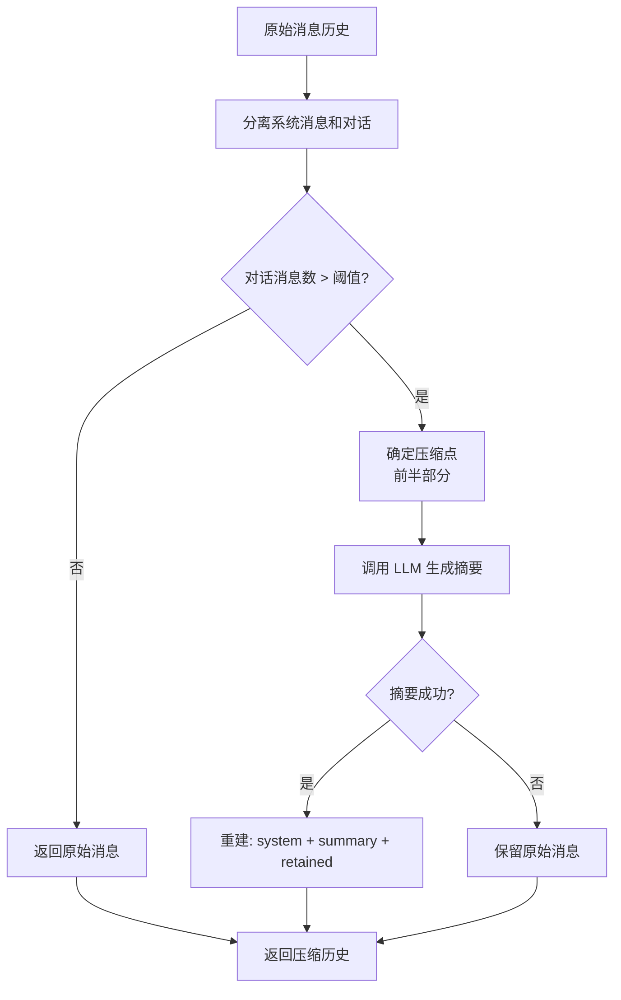
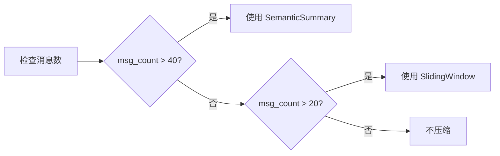
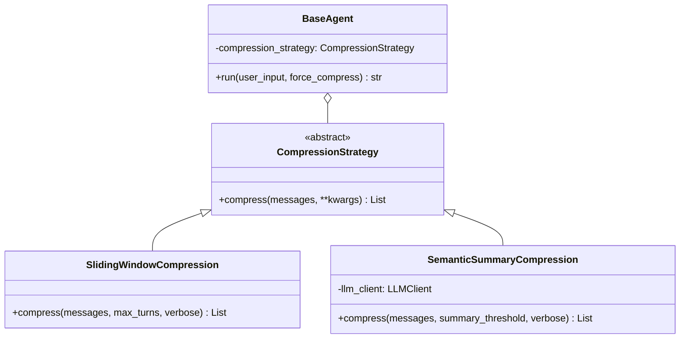

# Compression 模块文档

## 概述

Compression 模块提供对话历史压缩策略，用于管理长对话并控制上下文窗口。模块采用策略模式，支持多种压缩算法。

## 模块结构

```
compression/
├── base.py      # 抽象基类 CompressionStrategy
├── sliding.py   # 滑动窗口压缩
├── semantic.py  # 语义摘要压缩
└── __init__.py  # 模块导出
```

## 架构设计



## 核心组件

### 1. CompressionStrategy (base.py)

抽象基类，定义压缩策略的接口。

#### 抽象方法

```python
@abstractmethod
def compress(
    self,
    messages: List[Dict[str, Any]],
    **kwargs
) -> List[Dict[str, Any]]:
    """
    压缩消息历史。

    Args:
        messages: 当前消息历史
        **kwargs: 压缩策略的额外参数

    Returns:
        压缩后的消息历史
    """
    pass
```

#### 辅助函数

##### separate_system_messages(messages) -> List[Dict]

从历史中提取系统消息。

**特点：**
- 系统消息始终被保留
- 用于在压缩后重建完整的消息列表



### 2. SlidingWindowCompression (sliding.py)

滑动窗口压缩策略：保留最近的 N 轮对话。

#### 压缩原理



#### 方法签名

```python
def compress(
    self,
    messages: List[Dict[str, Any]],
    max_turns: int = 10,
    verbose: bool = False,
    **kwargs
) -> List[Dict[str, Any]]:
```

**参数：**
- `messages`: 当前消息历史
- `max_turns`: 保留的最近轮次数
- `verbose`: 是否打印压缩详情

**返回：**
- 压缩后的消息历史

#### 对话轮次定义

一轮对话包含：
1. 用户消息
2. 助手响应（可能包含 tool_calls）
3. 工具执行结果（如果有）

**示例：**

```
原始消息 (7 条消息):
1. [system] System prompt
2. [user] User input 1
3. [assistant] Assistant response 1
4. [user] User input 2
5. [assistant] Assistant response 2 (with tool_calls)
6. [tool] Tool result
7. [assistant] Assistant response 2 (text)

提取轮次:
- 轮次 1: 消息 2-3
- 轮次 2: 消息 4-7

max_turns=1 后压缩:
1. [system] System prompt
4. [user] User input 2
5. [assistant] Assistant response 2 (with tool_calls)
6. [tool] Tool result
7. [assistant] Assistant response 2 (text)
```

#### 优缺点

| 优点 | 缺点 |
|------|------|
| 简单快速 | 丢失早期上下文 |
| 无需额外 API 调用 | 可能丢失重要信息 |
| 可预测的行为 | 不适合需要长期记忆的任务 |

### 3. SemanticSummaryCompression (semantic.py)

语义摘要压缩：使用 LLM 总结早期对话。

#### 压缩原理



#### 初始化

```python
def __init__(self, llm_client: LLMClient):
    """
    Args:
        llm_client: 用于摘要生成的 LLM 客户端
    """
    self.llm_client = llm_client
```

#### 方法签名

```python
def compress(
    self,
    messages: List[Dict[str, Any]],
    summary_threshold: int = 5,
    max_summary_length: int = 200,
    verbose: bool = False,
    **kwargs
) -> List[Dict[str, Any]]:
```

**参数：**
- `messages`: 当前消息历史
- `summary_threshold`: 开始摘要的轮次阈值
- `max_summary_length`: 摘要的最大长度
- `verbose`: 是否打印压缩详情

#### 摘要策略

1. **阈值检查**：对话消息数必须超过 `summary_threshold * 3`
2. **压缩点**：取对话的前半部分进行摘要
3. **摘要保留**：保留后一半对话不变

**示例：**

```
原始消息:
1. [system] System prompt
2-9. [对话部分 1] - 8 条消息
10-17. [对话部分 2] - 8 条消息

summary_threshold=5:
- 阈值检查: 16 > 15? 是
- 压缩点: 消息 2-9 (前半部分)
- 生成摘要

压缩后:
1. [system] System prompt
2. [system] [Conversation Summary] ...摘要内容...
10-17. [对话部分 2]
```

#### 优缺点

| 优点 | 缺点 |
|------|------|
| 保留关键信息 | 需要额外的 API 调用 |
| 智能压缩 | 摘要可能不准确 |
| 适合长对话 | 增加响应延迟 |

## 压缩策略比较

| 特性 | SlidingWindow | SemanticSummary |
|------|--------------|----------------|
| 计算成本 | O(1) | O(1) + API 调用 |
| 上下文保留 | 仅最近轮次 | 摘要 + 最近轮次 |
| 信息保留 | 早期信息丢失 | 摘要保留关键信息 |
| 延迟 | 忽略不计 | API 调用延迟 |
| 适用场景 | 短到中等对话 | 长对话 |

## 使用示例

### 基本用法

```python
from src.compression import SlidingWindowCompression, SemanticSummaryCompression
from src.llm import LLMClient

# 滑动窗口压缩
sliding = SlidingWindowCompression()
compressed = sliding.compress(messages, max_turns=10)

# 语义摘要压缩
llm = LLMClient()
semantic = SemanticSummaryCompression(llm)
compressed = semantic.compress(
    messages,
    summary_threshold=5,
    max_summary_length=200
)
```

### 在 BaseAgent 中使用

```python
from src import BaseAgent

# 启用自动压缩
agent = BaseAgent(
    enable_compression=True,
    compression_type="sliding",  # 或 "semantic", "auto"
    compression_interval=20
)

# 手动强制压缩
agent.run("What did we discuss earlier?", force_compress="semantic")
```

### 混合策略（auto 模式）



## 压缩触发机制

### 自动压缩

在 BaseAgent 中，自动压缩基于：

1. **时间间隔**：`compression_interval` 轮触发一次
2. **消息数量**：根据 `compression_type` 选择策略

### 手动压缩

通过 `run()` 方法的 `force_compress` 参数：

```python
agent.run("Continue our discussion", force_compress="sliding")
# 或
agent.run("Continue our discussion", force_compress="semantic")
```

## 调试与监控

### Verbose 模式

所有压缩策略都支持 `verbose=True` 输出调试信息：

```python
sliding.compress(messages, max_turns=10, verbose=True)
# 输出:
# [SlidingWindow] Original messages: 45
# [SlidingWindow] Extracted turns: 15
# [SlidingWindow] Compressed messages: 32
# [SlidingWindow] Turns dropped: 5
```

### 统计信息

BaseAgent 跟踪压缩统计：

```python
stats = agent.get_compression_stats()
print(f"Sliding window: {stats['sliding_count']}")
print(f"Semantic summary: {stats['semantic_count']}")
```

## 设计模式

### 策略模式

Compression 模块使用策略模式：



**优势：**
- 易于添加新的压缩策略
- 运行时切换策略
- 策略间解耦

## 扩展指南

### 添加新的压缩策略

1. 继承 `CompressionStrategy`
2. 实现 `compress()` 方法
3. 在 BaseAgent 中集成

```python
from src.compression.base import CompressionStrategy

class CustomCompression(CompressionStrategy):
    def compress(self, messages, **kwargs):
        # 自定义压缩逻辑
        return compressed_messages

# 在 BaseAgent 中使用
def _trigger_manual_compression(self, compress_type, verbose):
    if compress_type == "custom":
        strategy = CustomCompression()
        self.messages = strategy.compress(self.messages, verbose=verbose)
```
