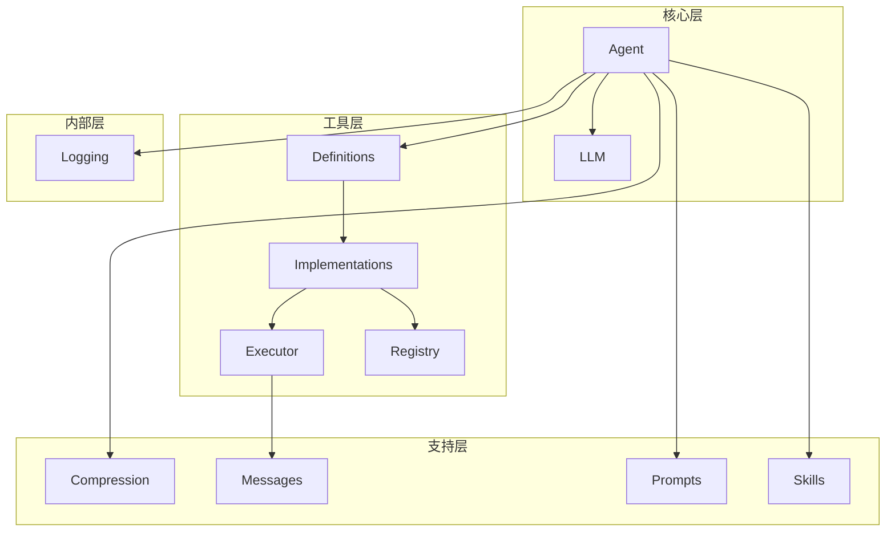
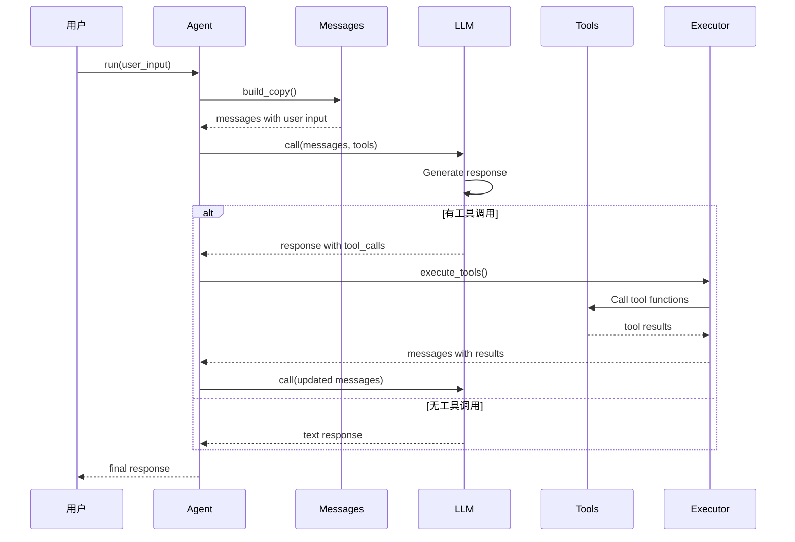

# mini_agent 工程文档

## 文档索引

本目录包含 `mini_agent` 项目的详细工程文档和用户手册。

### 用户指南

| 文档 | 描述 |
|------|------|
| **用户手册** | [user_manual.md](user_manual.md) | 面向开发者的快速上手指南 |

### 模块文档

| 模块 | 文档 | 描述 |
|------|------|------|
| **Agent** | [agent.md](agent.md) | 核心代理（BaseAgent 和 SubAgent）实现 |
| **Tools** | [tools.md](tools.md) | 工具定义、实现、执行和注册系统 |
| **LLM** | [llm.md](llm.md) | LLM 客户端和 API 交互 |
| **Compression** | [compression.md](compression.md) | 历史压缩策略（滑动窗口和语义摘要） |
| **Logging** | [logging.md](logging.md) | 内部日志记录和工具调用格式化 |
| **Messages** | [messages.md](messages.md) | 消息构建和管理 |
| **Prompts** | [prompts.md](prompts.md) | 系统提示词和提醒消息 |
| **Skills** | [skills.md](skills.md) | 领域知识管理系统 |

## 快速导航

### 核心概念



### 执行流程概览



## 项目结构

```
mini_agent/
├── src/
│   ├── agent/          # 代理实现
│   ├── tools/          # 工具系统
│   ├── llm/            # LLM 客户端
│   ├── compression/     # 压缩策略
│   ├── messages/       # 消息管理
│   ├── prompts/        # 系统提示词
│   ├── skills/         # 技能加载
│   └── logging/        # 内部日志
├── skills/             # 技能目录
└── docs/              # 本文档目录
```

## 设计原则

### 高内聚（High Cohesion）
- 每个模块有单一、明确定义的职责
- 相关功能组合在一起
- 跨模块依赖最小化

### 低耦合（Low Coupling）
- 模块通过明确定义的接口通信
- 依赖是显式且最小的
- 组件可以独立使用

### 模块职责

| 模块 | 职责 |
|------|------|
| `agent/` | 代理编排和生命周期 |
| `tools/` | 工具定义、实现和执行 |
| `llm/` | LLM API 交互 |
| `compression/` | 压缩策略（可插拔） |
| `logging/` | 内部格式化（不导出） |
| `messages/` | 消息构建工具 |
| `prompts/` | 静态提示词定义 |
| `skills/` | 技能加载和领域知识管理 |

## 系统特性

### 1. 工具调用系统
- OpenAI Function Calling 格式
- 可扩展的工具注册
- 安全的路径验证
- 命令执行保护

### 2. 子代理系统
- 隔离的执行上下文
- 三种代理类型（explore、code、plan）
- 防止无限递归

### 3. 历史压缩
- 滑动窗口策略
- 语义摘要策略
- 自动/手动触发

### 4. 技能系统
- 渐进式披露（3 层）
- Prompt Cache 友好
- 可编辑的 markdown 技能

### 5. Todo 跟踪
- 结构化任务列表
- 强制约束（最多 20 项，1 个进行中）
- NAG 提醒机制

## 快速开始

### 基本使用

```python
from src import BaseAgent

agent = BaseAgent(model="dashscope/qwen-turbo")
response = agent.run("List all files in current directory")
print(response)
```

### 启用子代理

```python
agent = BaseAgent(enable_subagent=True)
response = agent.run("Analyze this codebase")
```

### 启用压缩

```python
agent = BaseAgent(
    enable_compression=True,
    compression_type="auto",
    compression_interval=20
)
```

### 交互式聊天

```python
agent = BaseAgent()
agent.chat(verbose=True)
```

### 自定义工具

```python
agent = BaseAgent()

@agent.register_tool()
def calculate(expression: str) -> str:
    """安全计算数学表达式。"""
    try:
        return str(eval(expression))
    except Exception as e:
        return f"Error: {e}"

response = agent.run("Calculate 2 * (3 + 4)")
```

## 相关资源

- [项目 README](../README.md) - 项目概述和快速开始
- [CLAUDE.md](../CLAUDE.md) - Claude Code 使用指南
- [Skills 目录](../skills/) - 可用的技能定义

## 文档约定

### Mermaid 流程图

本文档使用 Mermaid 语法绘制流程图：
- `flowchart` - 流程图
- `sequenceDiagram` - 序列图
- `classDiagram` - 类图
- `graph` - 关系图

### 代码示例

代码块使用 Python 语法高亮：

```python
# Python 示例
from src import BaseAgent

agent = BaseAgent()
```

### 表格格式

| 列1 | 列2 | 列3 |
|------|------|------|
| 值1 | 值2 | 值3 |

## 贡献指南

添加新功能或修复 Bug 后，请更新相应的文档：
1. 在对应模块文档中添加描述
2. 更新本文档的索引
3. 添加必要的使用示例和流程图
