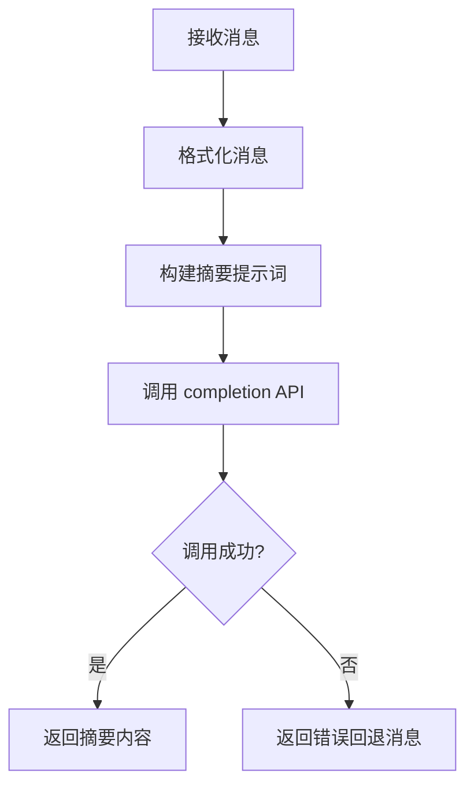
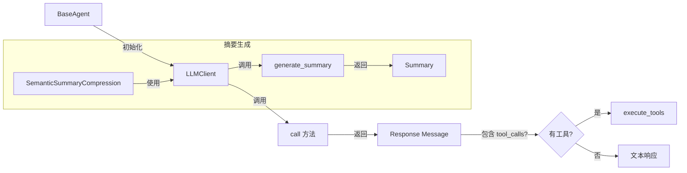

# LLM 模块文档

## 概述

LLM 模块是与大语言模型交互的客户端层，封装了 `litellm` 库的调用接口。该模块负责将对话消息发送到 LLM 并接收响应。

## 模块结构

```
llm/
├── client.py    # LLMClient 主类
└── __init__.py  # 模块导出
```

## 核心组件

### LLMClient

与 LLM 交互的客户端类。

#### 初始化参数

| 参数 | 类型 | 默认值 | 描述 |
|------|------|--------|------|
| `model` | str | `"dashscope/qwen-turbo"` | 使用的模型名称 |
| `temperature` | float | `0.0` | 采样温度（0.0 表示确定性输出） |
| `max_tokens` | int | None | 最大输出 token 限制 |

#### 主要方法

##### call(messages, tools=None) -> Any

向 LLM 发送完成请求。

**参数：**
- `messages`: 对话消息列表
- `tools`: 可选的工具定义列表（OpenAI Function Calling 格式）

**返回：**
- LLM 响应消息对象

**流程图：**

```mermaid
flowchart TD
    A[开始调用] --> B[构建参数字典]
    B --> C{有 tools?}
    C -->|是| D[添加 tools 参数]
    C -->|否| E[跳过 tools]
    D --> F{有 max_tokens?}
    E --> F
    F -->|是| G[添加 max_tokens 参数]
    F -->|否| H[跳过 max_tokens]
    G --> I[调用 litellm.completion]
    H --> I
    I --> J[返回 choices[0].message]
```

##### generate_summary(messages, max_length) -> str

生成给定消息的摘要。

**参数：**
- `messages`: 要摘要的消息列表
- `max_length`: 摘要的最大长度

**返回：**
- 生成的摘要字符串，失败时返回回退消息

**摘要提示词模板：**

```
Please summarize the following conversation history, preserving key information:
- User's main requests
- Tool calls executed and results (important results must be preserved)
- Completed task status

Conversation history:
{formatted_messages}

Provide a concise English summary within {max_length} characters.
```

**流程图：**



##### _format_messages(messages) -> str

静态方法，格式化消息用于显示/摘要。

**处理：**
- 每条消息最多截取 500 字符
- 格式：`{role}: {content}`

## 使用示例

### 基本用法

```python
from src.llm import LLMClient

# 创建客户端
client = LLMClient(
    model="dashscope/qwen-turbo",
    temperature=0.0
)

# 准备消息
messages = [
    {"role": "system", "content": "You are a helpful assistant."},
    {"role": "user", "content": "What is 2 + 2?"}
]

# 发送请求
response = client.call(messages)
print(response.content)  # "2 + 2 = 4"
```

### 带工具的调用

```python
from src.llm import LLMClient

client = LLMClient()

# 工具定义
tools = [
    {
        "type": "function",
        "function": {
            "name": "calculate",
            "description": "Perform calculation",
            "parameters": {
                "type": "object",
                "properties": {
                    "expression": {"type": "string"}
                },
                "required": ["expression"]
            }
        }
    }
]

messages = [
    {"role": "user", "content": "Calculate 2 * (3 + 4)"}
]

response = client.call(messages, tools=tools)
print(response.tool_calls)  # 工具调用对象
```

### 生成摘要

```python
from src.llm import LLMClient

client = LLMClient()

# 长对话历史
history = [
    {"role": "user", "content": "Tell me about Python"},
    {"role": "assistant", "content": "Python is a programming language..."},
    # ... 更多消息 ...
]

# 生成摘要
summary = client.generate_summary(history, max_length=200)
print(summary)
# Output: "User asked about Python. Assistant explained it's a high-level programming language..."
```

## 错误处理

`generate_summary` 方法处理以下异常：

| 异常类型 | 处理方式 |
|----------|----------|
| `APIError` | 返回包含错误类型的回退消息 |
| `Timeout` | 返回包含错误类型的回退消息 |
| `RateLimitError` | 返回包含错误类型的回退消息 |
| `Exception` | 返回包含错误类型的回退消息 |

## 集成要点

### 与 BaseAgent 的集成



### 消息格式要求

LLMClient 期望以下格式的消息：

```python
{
    "role": "system" | "user" | "assistant" | "tool",
    "content": str | List[Dict]  # 多模态格式支持
}
```

多模态格式示例：

```python
{
    "role": "user",
    "content": [
        {"type": "text", "text": "What do you see?"},
        {"type": "image_url", "image_url": {"url": "..."}}
    ]
}
```

## 设计考虑

### 温度控制

- `temperature = 0.0`: 确定性输出，适合代码生成和精确任务
- `temperature > 0`: 更有创造性，适合创意写作

### Token 限制

设置 `max_tokens` 可以：
- 控制输出长度
- 预防过长的响应
- 节省 API 调用成本

### 重用策略

LLMClient 在 BaseAgent 中复用：
- 一次初始化，多次调用
- 共享 model、temperature 配置
- 在 SemanticSummaryCompression 中也复用同一实例
