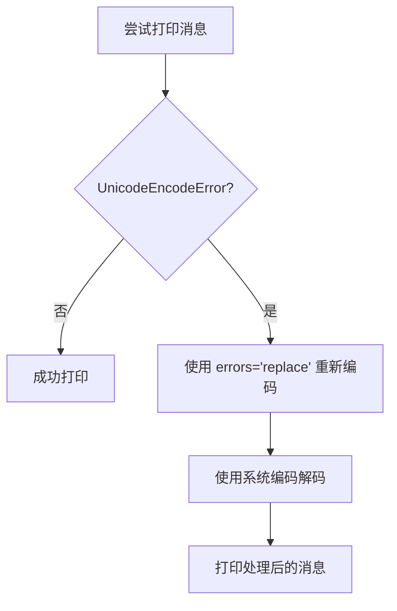

# Logging 模块文档

## 概述

Logging 模块提供内部日志记录和工具调用格式化功能。该模块用于代理内部调试和输出格式化，不是公共 API 的一部分。

## 模块结构

```
logging/
├── formatter.py  # Logger 和 ToolCallPrinter 类
└── __init__.py   # 模块导出
```

## 核心组件

### 1. Logger

带有时间戳和缩进支持的内部日志记录器。

#### 初始化

```python
def __init__(self, name: str = "Agent"):
    """
    Args:
        name: 日志记录器名称，显示在输出中
    """
```

#### 主要方法

##### log(message, indent=0, emoji="")

记录带有时间戳和可选缩进/emoji 的消息。

**参数：**
- `message`: 要记录的消息
- `indent`: 缩进级别（每级 2 个空格）
- `emoji`: 可选的 emoji 前缀

**输出格式：**

```
[HH:MM:SS.mmm] [LoggerName]  emoji message
[HH:MM:SS.mmm] [LoggerName]    emoji indented message
```

**示例：**

```python
logger = Logger("MyAgent")

logger.log("Starting execution...", emoji="🚀")
# 输出: [14:23:45.678] [MyAgent]  🚀 Starting execution...

logger.log("Processing data", indent=1, emoji="⚙️")
# 输出: [14:23:45.679] [MyAgent]    ⚙️ Processing data
```

##### separator(char="-", length=50)

打印分隔线以提高可读性。

**参数：**
- `char`: 分隔线使用的字符
- `length`: 分隔线长度

**输出格式：**

```
  [LoggerName] --------------------------------------------------
```

**示例：**

```python
logger.separator("=", 60)
logger.separator("-", 40)
logger.separator("▸", 50)
```

### 2. ToolCallPrinter

工具调用和结果的格式化打印器。

#### 初始化

```python
def __init__(self, logger: Optional[Logger] = None):
    """
    Args:
        logger: 可选的日志记录器，默认创建新的
    """
```

#### 主要方法

##### print_calls(tool_calls)

格式化打印工具调用。

**参数：**
- `tool_calls`: LLM 响应中的工具调用对象列表

**输出格式：**

```
  [LoggerName] 🔧 Tool Calls:
  [LoggerName]    1. tool_name({"arg": "value"})
  [LoggerName]    2. another_tool({"arg1": "v1", ...})
```

**示例：**

```python
printer = ToolCallPrinter(logger)

# 假设有工具调用
printer.print_calls(response_message.tool_calls)
```

##### print_results(messages, tool_calls)

格式化打印工具结果。

**参数：**
- `messages`: 当前消息历史（包括工具结果）
- `tool_calls`: 已执行的工具调用列表

**输出格式：**

```
  [LoggerName] 📊 Tool Results:
  [LoggerName]    1. tool_name: Result content...
  [LoggerName]    2. another_tool: Result content...
```

##### is_todo_called(response_message) -> bool

检查响应中是否调用了 todo 工具。

**参数：**
- `response_message`: LLM 响应消息

**返回：**
- `True` 如果调用了 todo 工具，否则 `False`

##### is_skill_called(response_message) -> bool

检查响应中是否调用了 skill 工具。

**参数：**
- `response_message`: LLM 响应消息

**返回：**
- `True` 如果调用了 run_skill 工具，否则 `False`

## 工具调用输出示例

### 完整的 verbose 输出流程

```python
agent = BaseAgent()
agent.run("List files in current directory", verbose=True)
```

**输出示例：**

```
============================================================
[14:23:45.123] [Agent] 🔄 NEW TURN #1
[14:23:45.123] [Agent]    Model: dashscope/qwen-turbo
[14:23:45.123] [Agent]    Input: List files in current directory
[14:23:45.123] [Agent]    Messages in history: 1
--------------------------------------------------------
[14:23:45.124] [Agent]    📋 Messages prepared: 2
[14:23:45.124] [Agent] 🔄 Entering tool execution loop...
[14:23:45.125] [Agent] ...............................
[14:23:45.125] [Agent]    Loop iteration #1

[14:23:45.200] [Agent]    🔧 Tool Calls:
[14:23:45.201] [Agent]      1. bash({"command": "ls -la"})

[14:23:45.201] [Agent]    📊 Tool Results:
[14:23:45.202] [Agent]      1. bash: drwxr-xr-x  4 user group ...

[14:23:45.203] [Agent] ...............................
[14:23:45.203] [Agent]    Loop iteration #2
[14:23:45.203] [Agent]    No tool calls in this iteration
[14:23:45.203] [Agent]    ✅ Tool loop completed after 2 iteration(s)
[14:23:45.203] [Agent]    History updated: 4 messages
[14:23:45.203] [Agent] 💬 Response: Here are the files...
============================================================
```

## 子代理输出

### SubAgent verbose 输出

```
▸▸▸▸▸▸▸▸▸▸▸▸▸▸▸▸▸▸▸▸▸▸▸▸▸▸▸▸▸▸▸▸▸▸▸▸▸▸▸▸
[14:23:45.300] [Agent] 🚀 SPAWNING SUBAGENT (explore)
[14:23:45.300] [Agent]    Description: Find auth module usage

[14:23:45.301] [SubAgent] ▶️ Starting subagent execution...
[14:23:45.301] [SubAgent]    Input: Find all files using the auth module...
[14:23:45.301] [SubAgent] .........................
[14:23:45.301] [SubAgent]    Loop iteration #1
[14:23:45.301] [SubAgent]    Calling LLM... 🤖
[14:23:45.302] [SubAgent]    🔧 Tool Calls:
[14:23:45.302] [SubAgent]      1. bash({"command": "grep -r \"auth\" src/"})
...

[14:23:45.310] [SubAgent]    📊 Tool Results:
[14:23:45.310] [SubAgent]      1. bash: src/agent/core.py: ...

[14:23:45.320] [SubAgent] .........................
[14:23:45.320] [SubAgent]    Loop iteration #2
[14:23:45.320] [SubAgent]    No tool calls - returning response
[14:23:45.320] [SubAgent]    ✅ Result: Found 5 files using auth module...

[14:23:45.320] [Agent] ✅ SUBAGENT COMPLETED
[14:23:45.320] [Agent]    Result: Found 5 files using auth module. Main usage is in...
▸▸▸▸▸▸▸▸▸▸▸▸▸▸▸▸▸▸▸▸▸▸▸▸▸▸▸▸▸▸▸▸▸▸▸▸▸▸▸▸
```

## 安全输出处理

### _safe_print(message)

Windows 环境下处理编码错误的辅助函数。

**处理逻辑：**



**实现：**

```python
def _safe_print(message: str) -> None:
    """Print a message safely, handling encoding errors on Windows."""
    try:
        print(message)
    except UnicodeEncodeError:
        # Fallback: replace unencodable characters
        print(message.encode(sys.stdout.encoding, errors='replace')
              .decode(sys.stdout.encoding))
```

## 使用示例

### 独立使用 Logger

```python
from src.logging.formatter import Logger

logger = Logger("MyModule")

logger.log("Initializing module", emoji="🔧")
logger.log("Loading configuration", indent=1)
logger.log("Configuration loaded successfully", indent=2, emoji="✅")

logger.separator("=", 60)
logger.log("Processing complete", emoji="🎉")
```

**输出：**

```
[14:23:45.123] [MyModule]  🔧 Initializing module
[14:23:45.124] [MyModule]    Loading configuration
[14:23:45.125] [MyModule]      ✅ Configuration loaded successfully
  [MyModule] ============================================================
[14:23:45.126] [MyModule]  🎉 Processing complete
```

### 独立使用 ToolCallPrinter

```python
from src.logging.formatter import Logger, ToolCallPrinter

logger = Logger("Debug")
printer = ToolCallPrinter(logger)

# 假设有 LLM 响应
if hasattr(response, 'tool_calls') and response.tool_calls:
    printer.print_calls(response.tool_calls)

    # 检查特定工具是否被调用
    if printer.is_todo_called(response):
        logger.log("Todo tool was called!", emoji="📝")

    if printer.is_skill_called(response):
        logger.log("Skill tool was called!", emoji="📚")
```

## 在 BaseAgent 中的使用

### 初始化

```python
# agent/core.py
from src.logging.formatter import Logger, ToolCallPrinter

class BaseAgent:
    def __init__(self, ...):
        self.logger = Logger("Agent")
        self.tool_printer = ToolCallPrinter(self.logger)
```

### 在运行时使用

```python
# 打印 header
self.logger.separator("=", 60)
self.logger.log(f"NEW TURN #{self.turn_count + 1}", emoji="🔄")

# 工具循环中打印
if verbose:
    self.logger.separator(".", 30)
    self.logger.log(f"Loop iteration #{loop_count}", indent=1)

    if response_message.tool_calls:
        self.tool_printer.print_calls(response_message.tool_calls)

# 打印结果
if verbose and has_more_tools:
    self.tool_printer.print_results(messages, response_message.tool_calls)
```

## 设计特点

### 结构化输出

- 时间戳精确到毫秒
- 模块名称标识
- 可缩进的层次结构
- emoji 视觉辅助

### 分离关注点

- `Logger`: 通用日志记录
- `ToolCallPrinter`: 特定于工具调用的格式化

### 内部使用

该模块设计为框架内部使用：
- 不是公共 API 的一部分
- 用于调试和开发
- 便于理解代理执行流程
