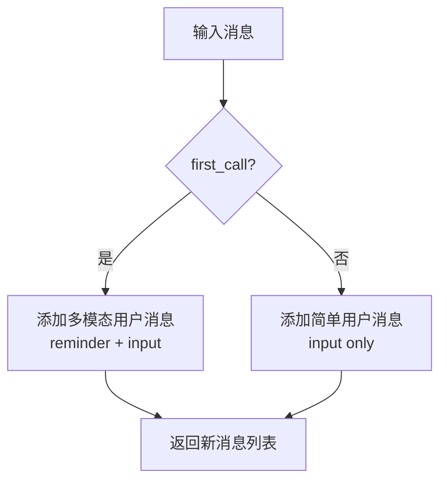
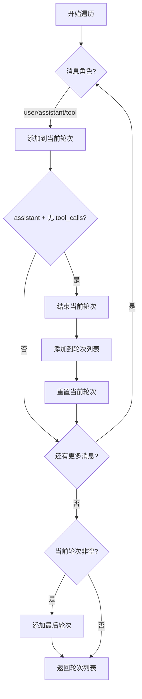
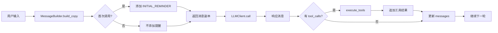
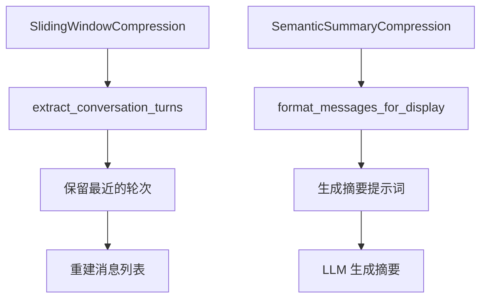

# Messages 模块文档

## 概述

Messages 模块处理消息的构建和管理，为 LLM 交互提供格式化功能。该模块处理 OpenAI 风格的消息格式，包括多模态内容支持。

## 模块结构

```
messages/
├── builder.py   # MessageBuilder 类和辅助函数
└── __init__.py  # 模块导出
```

## 核心组件

### 1. MessageBuilder 类

消息构建器，用于构造和管理 LLM 交互的消息。

#### 主要方法

##### build_copy(messages, user_input, first_call, initial_reminder) -> List[Dict]

构建消息副本并添加新的用户输入。

**参数：**
- `messages`: 当前消息历史
- `user_input`: 要添加的用户消息
- `first_call`: 是否是首次调用
- `initial_reminder`: 首次调用的提醒消息

**返回：**
- 准备好 LLM 处理的新消息列表

**逻辑流程：**



**示例：**

```python
# 首次调用
messages = build_copy(
    [{"role": "system", "content": "You are helpful."}],
    "Hello!",
    first_call=True,
    initial_reminder="<reminder>Use tools wisely.</reminder>"
)
# 结果:
# [
#   {"role": "system", "content": "You are helpful."},
#   {"role": "user", "content": [
#     {"type": "text", "text": "<reminder>Use tools wisely.</reminder>"},
#     {"type": "text", "text": "Hello!"}
#   ]}
# ]

# 后续调用
messages = build_copy(messages, "How are you?", first_call=False, initial_reminder="...")
# 结果:
# [
#   ... (previous messages),
#   {"role": "user", "content": "How are you?"}
# ]
```

##### get_message_count(messages) -> int

获取非系统消息的数量。

**参数：**
- `messages`: 消息历史

**返回：**
- user、assistant 和 tool 消息的数量

**示例：**

```python
messages = [
    {"role": "system", "content": "..."},
    {"role": "user", "content": "..."},
    {"role": "assistant", "content": "..."},
    {"role": "tool", "content": "..."},
    {"role": "user", "content": "..."}
]
count = get_message_count(messages)  # 4 (不包括 system)
```

##### extract_conversation_turns(messages) -> List[List[Dict]]

从消息历史中提取对话轮次。

**轮次定义：**
一轮对话包含：
1. 用户消息
2. 助手响应（可能包含 tool_calls）
3. 工具结果（如果有）

轮次在助手响应且**没有** tool_calls 时结束。

**逻辑流程：**



**示例：**

```python
messages = [
    {"role": "system", "content": "System prompt"},
    {"role": "user", "content": "Input 1"},
    {"role": "assistant", "content": "Response 1", "tool_calls": [...]},
    {"role": "tool", "name": "bash", "content": "Result"},
    {"role": "assistant", "content": "Final response 1"},
    {"role": "user", "content": "Input 2"},
    {"role": "assistant", "content": "Response 2 (no tools)"}
]

turns = extract_conversation_turns(messages)
# 结果:
# [
#   [
#     {"role": "user", "content": "Input 1"},
#     {"role": "assistant", "content": "Response 1", "tool_calls": [...]},
#     {"role": "tool", "name": "bash", "content": "Result"},
#     {"role": "assistant", "content": "Final response 1"}
#   ],
#   [
#     {"role": "user", "content": "Input 2"},
#     {"role": "assistant", "content": "Response 2 (no tools)"}
#   ]
# ]
```

##### extract_response_text(response_message) -> str

从 LLM 响应消息中提取文本内容。

**参数：**
- `response_message`: LLM 响应消息对象

**返回：**
- 文本内容，不可用时返回空字符串

##### format_for_summary(messages) -> str

格式化消息用于摘要提示词。

**参数：**
- `messages`: 要格式化的消息

**返回：**
- 格式化的消息字符串

**格式：** 每条消息一行，`{role}: {content}`，内容最多 500 字符

### 2. 辅助函数

#### _extract_message_content(content) -> str

从消息的 content 字段中提取文本内容。

**支持的内容格式：**

| 格式 | 示例 | 处理方式 |
|------|------|----------|
| None | `None` | 返回空字符串 |
| 列表（多模态） | `[{"type": "text", "text": "..."}]` | 提取所有 text 值 |
| 字符串 | `"plain text"` | 直接返回 |
| 其他类型 | `123`, `[]` | 转换为字符串 |

**示例：**

```python
# 多模态格式
content = [
    {"type": "text", "text": "Hello"},
    {"type": "image_url", "image_url": {"url": "..."}}
]
result = _extract_message_content(content)  # "Hello"

# 字符串格式
result = _extract_message_content("Plain text")  # "Plain text"

# None
result = _extract_message_content(None)  # ""
```

#### format_messages_for_display(messages, max_content_length=500) -> str

格式化消息用于显示（如在摘要提示词中）。

**参数：**
- `messages`: 要格式化的消息
- `max_content_length`: 每条消息的最大内容长度

**返回：**
- 格式化的字符串，每条消息一行

**示例：**

```python
messages = [
    {"role": "user", "content": "This is a long message that exceeds the limit..."},
    {"role": "assistant", "content": "Response"}
]

formatted = format_messages_for_display(messages, max_content_length=20)
# 结果:
# "user: This is a long mess...
# assistant: Response"
```

## 消息格式

### OpenAI 风格消息格式

```python
{
    "role": "system" | "user" | "assistant" | "tool",
    "content": str | List[Dict],  # 多模态支持
    # 可选字段:
    "tool_calls": [...],  # 助手响应中的工具调用
    "tool_call_id": "...",  # 工具结果消息的 ID
    "name": "tool_name"  # 工具结果消息的工具名
}
```

### 多模态内容格式

```python
{
    "role": "user",
    "content": [
        {"type": "text", "text": "What do you see?"},
        {"type": "image_url", "image_url": {"url": "https://..."}},
        {"type": "text", "text": "Describe it."}
    ]
}
```

## 使用示例

### 构建消息

```python
from src.messages import MessageBuilder

builder = MessageBuilder()

# 构建首次调用消息
messages = [
    {"role": "system", "content": "You are helpful."}
]

messages = builder.build_copy(
    messages,
    "Hello, assistant!",
    first_call=True,
    initial_reminder="<reminder>Be concise.</reminder>"
)
```

### 提取对话轮次

```python
from src.messages import MessageBuilder

# 假设有对话历史
history = [...]  # 来自 agent.get_history()

turns = MessageBuilder.extract_conversation_turns(history)
print(f"Total turns: {len(turns)}")

for i, turn in enumerate(turns):
    print(f"Turn {i + 1}: {len(turn)} messages")
```

### 格式化消息用于摘要

```python
from src.messages import MessageBuilder

messages = [
    {"role": "user", "content": "Tell me about Python"},
    {"role": "assistant", "content": "Python is a programming language..."},
    {"role": "user", "content": "Is it easy to learn?"},
    {"role": "assistant", "content": "Yes, Python is beginner-friendly..."}
]

formatted = MessageBuilder.format_for_summary(messages)
print(formatted)
# 输出:
# user: Tell me about Python
# assistant: Python is a programming language...
# user: Is it easy to learn?
# assistant: Yes, Python is beginner-friendly...
```

### 提取响应文本

```python
from src.messages import MessageBuilder

# 假设有 LLM 响应
response_message = llm_client.call(messages)

# 提取文本内容
text = MessageBuilder.extract_response_text(response_message)
print(text)
```

## 在 BaseAgent 中的使用

### 消息构建流程



### 压缩中的使用



## 设计原则

### 不可变操作

`build_copy()` 返回新列表而不是修改输入：
- 防止意外的副作用
- 便于回溯和调试
- 符合函数式编程原则

### 灵活的内容处理

支持多种内容格式：
- 简单字符串
- 多模态列表
- None 处理

### 关注点分离

- `MessageBuilder`: 高级消息操作
- `format_messages_for_display`: 格式化工具
- `_extract_message_content`: 内容提取工具

## 扩展指南

### 添加新的消息类型

```python
def extract_audio_transcript(content):
    """从多模态内容中提取音频转录。"""
    if not isinstance(content, list):
        return ""

    for item in content:
        if item.get("type") == "audio":
            return item.get("transcript", "")
    return ""
```

### 自定义轮次提取逻辑

```python
def extract_custom_turns(messages, end_condition):
    """使用自定义条件提取轮次。"""
    turns = []
    current = []

    for msg in messages:
        current.append(msg)
        if end_condition(msg):
            turns.append(current)
            current = []

    if current:
        turns.append(current)

    return turns
```
