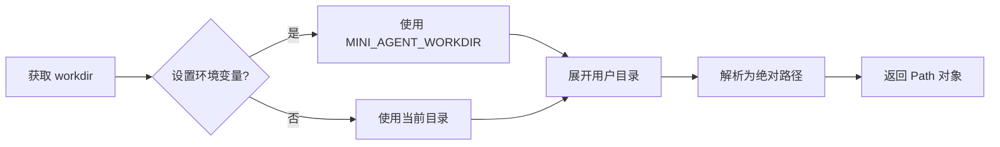

# Prompts 模块文档

## 概述

Prompts 模块提供系统提示词和提醒消息的定义。该模块负责生成代理的系统提示词和管理工作目录配置。

## 模块结构

```
prompts/
├── system.py    # 系统提示词和配置
└── __init__.py  # 模块导出
```

## 核心组件

### 1. 工作目录配置

#### get_workdir() -> Path

获取代理的工作目录。

**配置来源（优先级）：**

1. 环境变量 `MINI_AGENT_WORKDIR`
2. 当前工作目录（默认）

**流程：**



**示例：**

```bash
# 设置工作目录
export MINI_AGENT_WORKDIR=/path/to/project

# Python 中
from src.prompts import get_workdir, WORKDIR

workdir = get_workdir()  # /path/to/project
print(WORKDIR)  # /path/to/project
```

#### WORKDIR

默认工作目录，在模块加载时初始化。

```python
WORKDIR = get_workdir()
```

### 2. 系统提示词

#### get_system_prompt(workdir=None) -> str

获取代理的系统提示词。

**参数：**
- `workdir`: 可选的工作目录，未提供时使用 `get_workdir()`

**返回：**
- 系统提示词字符串

**默认提示词模板：**

```
You are a coding agent at {workdir}.

Loop: plan -> act with tools -> report.

You can spawn subagents for complex subtasks.
Use TodoWrite to track multi-step work.
Use skill tool IMMEDIATELY when a task matches a skill description.
Prefer tools over prose. Act, don't just explain.
After finishing, summarize what changed.
```

**特点：**
- 包含当前工作目录路径
- 定义代理的工作循环
- 指导子代理使用
- 强调 Todo 工具的重要性
- 提醒立即使用技能工具
- 鼓励行动胜于解释

#### SYSTEM

导出的系统提示词常量（向后兼容）。

```python
SYSTEM = get_system_prompt()
```

### 3. 提醒消息

#### INITIAL_REMINDER

首次调用时插入的提醒消息。

```python
INITIAL_REMINDER = "<reminder>Use TodoWrite for multi-step tasks.</reminder>"
```

**用途：**
- 在首次对话轮次中插入
- 提醒代理使用 Todo 工具跟踪多步骤任务

#### NAG_REMINDER

长时间未更新 todo 时插入的提醒消息。

```python
NAG_REMINDER = "<reminder>10+ turns without todo update. Please update todos.</reminder>"
```

**触发条件：**
- 连续 10 轮以上未调用 todo 工具
- 由 BaseAgent 自动检测并插入

## 提示词架构

### 系统提示词结构

```mermaid
graph LR
    subgraph SystemPrompt ["系统提示词"]
        A[身份定位<br/>You are a coding agent at {workdir}]
        B[工作循环<br/>plan -> act with tools -> report]
        C[子代理能力<br/>You can spawn subagents]
        D[Todo 跟踪<br/>Use TodoWrite for multi-step work]
        E[技能加载<br/>Use skill tool IMMEDIATELY]
        F[行动导向<br/>Prefer tools over prose]
        G[总结要求<br/>Summarize what changed]
    end

    A --> B --> C --> D --> E --> F --> G
```

### 消息结构中的提示词

```python
# 首次调用时的消息结构
messages = [
    {
        "role": "system",
        "content": SYSTEM  # 完整的系统提示词
    },
    {
        "role": "user",
        "content": [
            {"type": "text", "text": INITIAL_REMINDER},  # 提醒
            {"type": "text", "text": user_input}  # 用户输入
        ]
    }
]

# 后续调用时的消息结构
messages = [
    {...},  # 历史消息
    {
        "role": "user",
        "content": user_input  # 仅用户输入
    }
]

# NAG 提醒插入
messages.append({
    "role": "user",
    "content": [
        {"type": "text", "text": NAG_REMINDER},
        {"type": "text", "text": "placeholder"}  # 必须有两条
    ]
})
```

## 使用示例

### 使用默认系统提示词

```python
from src.prompts import SYSTEM, INITIAL_REMINDER

messages = [
    {"role": "system", "content": SYSTEM}
]
```

### 自定义系统提示词

```python
from src import BaseAgent

# 创建时指定自定义提示词
agent = BaseAgent(
    system_prompt="You are a Python expert. Always use type hints."
)

# 自定义提示词会覆盖默认的 SYSTEM
```

### 使用工作目录信息

```python
from src.prompts import get_workdir, WORKDIR

# 获取工作目录
workdir = get_workdir()
print(f"Working in: {workdir}")

# 使用全局 WORKDIR
print(f"Workspace: {WORKDIR}")
```

### 提醒消息的使用

```python
from src.prompts import INITIAL_REMINDER, NAG_REMINDER

# 在首次调用时插入
first_message = {
    "role": "user",
    "content": [
        {"type": "text", "text": INITIAL_REMINDER},
        {"type": "text", "text": "Your actual input here"}
    ]
}

# NAG 提醒通常由 BaseAgent 自动处理
# 当检测到长时间未更新 todo 时自动插入
```

## 在 BaseAgent 中的使用流程

```mermaid
flowchart TB
    A[BaseAgent 初始化] --> B{提供自定义系统提示词?}
    B -->|是| C[使用自定义提示词]
    B -->|否| D[使用默认 SYSTEM]
    C --> E[初始化 messages]
    D --> E
    E --> F[messages = [{'role': 'system', 'content': system_prompt}]]

    G[调用 run] --> H{首次调用?}
    H -->|是| I[build_copy 添加 INITIAL_REMINDER]
    H -->|否| J[仅添加用户输入]
    I --> K[发送到 LLM]
    J --> K

    L[检查 todo 更新] --> M{超过 10 轮未更新?}
    M -->|是| N[插入 NAG_REMINDER]
    M -->|否| O[继续]
    N --> O
```

## 设计原则

### 简洁性

- 系统提示词保持简短
- 专注于核心行为指导
- 避免冗长的指令

### 行为导向

- 强调"做"而非"解释"
- 提示使用工具而非文字描述
- 鼓励总结结果

### 分层提醒

1. **系统提示词**：核心行为规则
2. **INITIAL_REMINDER**：首次使用提醒
3. **NAG_REMINDER**：长时间未使用的催促

## 环境配置

### MINI_AGENT_WORKDIR

设置代理的工作目录。

**Unix/Linux/macOS:**

```bash
export MINI_AGENT_WORKDIR=/path/to/project
python your_script.py
```

**Windows (PowerShell):**

```powershell
$env:MINI_AGENT_WORKDIR="C:\path\to\project"
python your_script.py
```

**Windows (CMD):**

```cmd
set MINI_AGENT_WORKDIR=C:\path\to\project
python your_script.py
```

**在 Python 中设置：**

```python
import os
os.environ["MINI_AGENT_WORKDIR"] = "/path/to/project"

from src.prompts import get_workdir
workdir = get_workdir()  # 使用新设置的值
```

## 扩展指南

### 添加新的提醒类型

```python
# 在 prompts/system.py 中添加
SKILL_REMINDER = "<reminder>Consider loading a skill for this task.</reminder>"

# 在 BaseAgent 中使用
def _should_add_skill_reminder(self) -> bool:
    """判断是否需要技能提醒。"""
    return self.skill_count == 0 and self.turn_count > 5

def _add_skill_reminder(self, verbose: bool) -> None:
    """添加技能提醒。"""
    if verbose:
        self.logger.log("Adding skill reminder", emoji="📚")
    self.messages.append({
        "role": "user",
        "content": SKILL_REMINDER
    })
```

### 自定义系统提示词模板

```python
from pathlib import Path

def get_system_prompt_template(
    role: str = "coding agent",
    workdir: Path = None
) -> str:
    """生成自定义系统提示词。"""
    if workdir is None:
        workdir = get_workdir()

    return f"""You are a {role} at {workdir}.

Follow these principles:
1. Be concise and direct
2. Use tools when appropriate
3. Provide code examples
4. Explain your reasoning
"""
```
