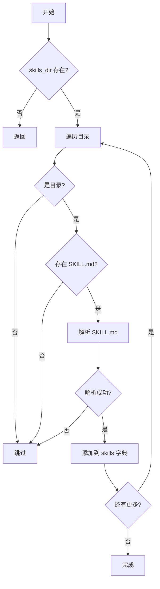
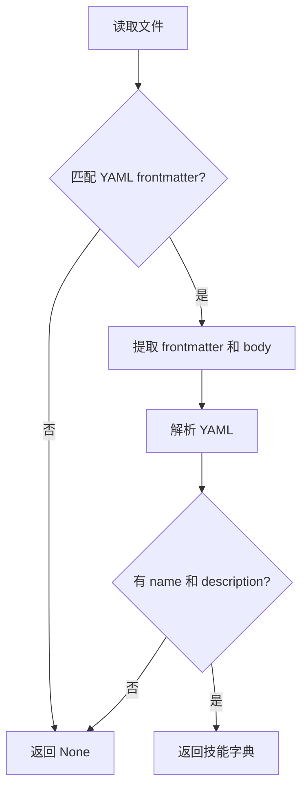
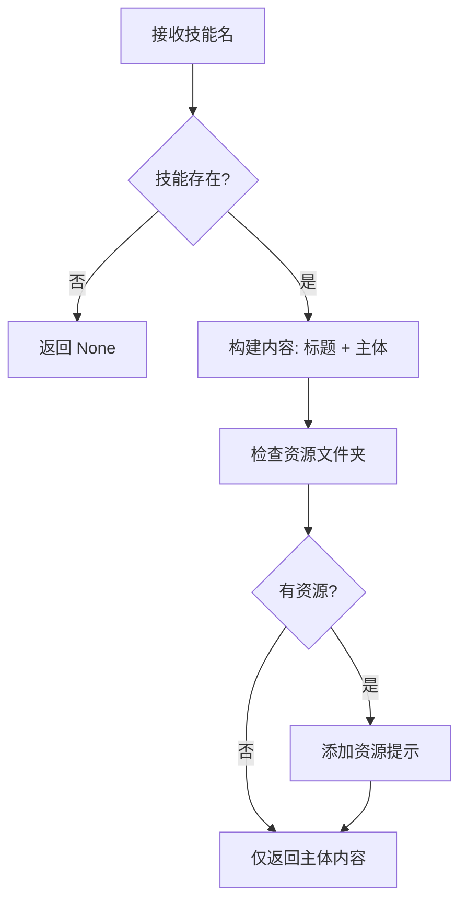
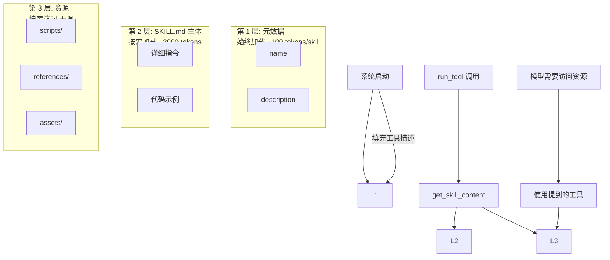
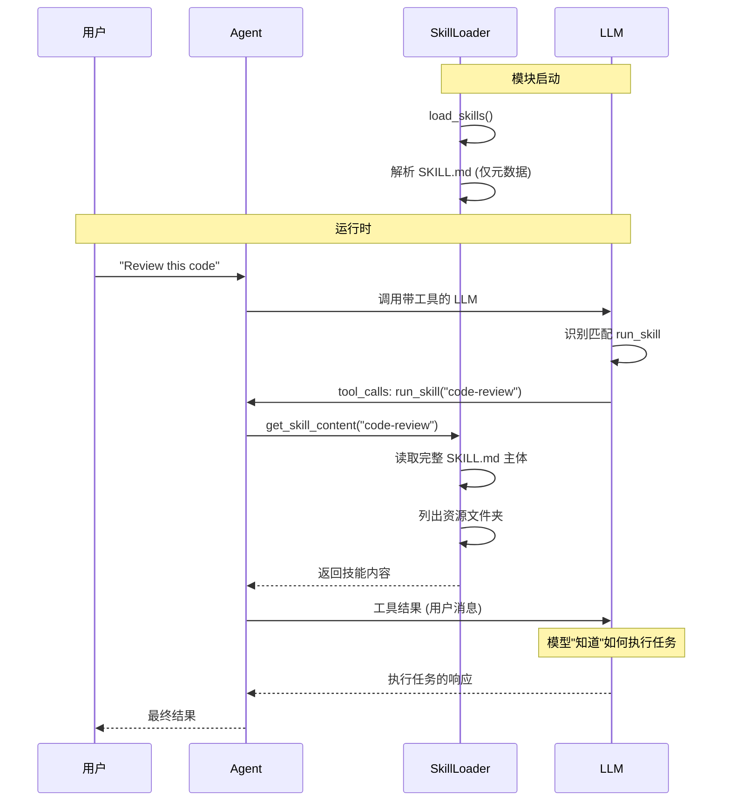

# Skills 模块文档

## 概述

Skills 模块提供领域知识管理系统。技能是可按需加载的领域知识包，将外部知识以可编辑的 markdown 文件形式存储，而不是锁定在模型参数中。

## 模块结构

```
skills/
├── loader.py    # SkillLoader 类
└── __init__.py  # 模块导出

# 技能目录结构（在项目根目录）
skills/
├── git/
│   └── SKILL.md
├── code-review/
│   ├── SKILL.md
│   ├── scripts/    # 可选
│   ├── references/ # 可选
│   └── assets/     # 可选
└── pdf/
    ├── SKILL.md
    └── scripts/
        └── process_pdf.py
```

## 核心概念

### 技能定义

技能是一个**文件夹**，包含：

| 文件/文件夹 | 必需 | 描述 |
|------------|------|------|
| `SKILL.md` | 是 | YAML frontmatter + markdown 指令 |
| `scripts/` | 否 | 模型可运行的辅助脚本 |
| `references/` | 否 | 额外文档参考 |
| `assets/` | 否 | 模板、输出文件 |

### SKILL.md 格式

```markdown
---
name: skill-name
description: Brief description of what this skill does
---

# Skill Title

Detailed instructions for using this skill...

## Section 1
...

## Section 2
...
```

## 核心组件

### 1. SkillLoader 类

加载和管理技能的系统。

#### 初始化

```python
def __init__(self, skills_dir: Path):
    """
    Args:
        skills_dir: 技能目录路径
    """
    self.skills_dir = skills_dir
    self.skills: Dict[str, Dict] = {}
    self.load_skills()  # 启动时自动加载
```

#### 主要方法

##### load_skills()

扫描技能目录并加载所有有效的 SKILL.md 文件。

**特点：**
- 仅加载元数据（名称、描述）
- 技能主体按需加载
- 保持初始上下文精简

**流程：**



##### parse_skill_md(path) -> Optional[Dict]

解析 SKILL.md 文件为元数据和主体。

**返回字典：**

```python
{
    "name": "skill-name",
    "description": "Brief description",
    "body": "Markdown content...",
    "path": Path(".../SKILL.md"),
    "dir": Path(".../skill-folder")
}
```

**解析逻辑：**



**Frontmatter 解析：**

```python
# 简单的 key: value 解析
for line in frontmatter.strip().split("\n"):
    if ":" in line:
        key, value = line.split(":", 1)
        metadata[key.strip()] = value.strip().strip("\"'")
```

##### get_descriptions() -> str

生成技能描述用于系统提示词。

**特点：**
- 第 1 层：仅名称和描述
- 约 100 tokens/技能
- 用于工具描述填充

**输出格式：**

```
- git: Git operations for version control
- code-review: Review code for bugs and best practices
- pdf: Process PDF files. Use when reading, creating, or merging PDFs.
```

##### get_skill_content(name: str) -> Optional[str]

获取完整的技能内容用于注入。

**特点：**
- 第 2 层：完整 SKILL.md 主体
- 第 3 层：资源提示（脚本、引用、资产）
- 约 2000 tokens/技能

**返回内容格式：**

```markdown
# Skill: {name}

{skill body}

**Available resources in {skill_dir}:**
- Scripts: script1.py, script2.py
- References: guide.md
- Assets: template.txt
```

**流程：**



##### list_skills() -> List[str]

返回可用的技能名称列表。

## 渐进式披露（Progressive Disclosure）

技能系统使用分层加载以提高上下文效率：



### 分层说明

| 层级 | 内容 | 何时加载 | Token 大小 |
|------|------|----------|------------|
| 第 1 层 | 名称 + 描述 | 模块启动时 | ~100 tokens/skill |
| 第 2 层 | SKILL.md 主体 | run_tool 被调用时 | ~2000 tokens |
| 第 3 层 | 资源文件夹 | 模型需要时 | 不限制 |

## 工作原理

### 技能加载流程



### 关键设计决策

#### 技能内容注入方式

**方案选择：** 将技能内容作为 `tool_result`（用户消息）注入

**原因：**


**为什么重要：**
- OpenAI 的 Prompt Cache 基于消息前缀
- 系统提示词变更会使整个前缀失效
- 作为用户消息追加不影响前缀
- 仅新内容需要计算，成本大幅降低

## 使用示例

### 创建新技能

**1. 创建技能目录和文件：**

```
mkdir -p skills/my-task/skills
touch skills/my-task/SKILL.md
```

**2. 编写 SKILL.md：**

```markdown
---
name: my-task
description: Perform a specific complex task
---

# My Task Skill

Use this skill when the user requests [describe when to use].

## Prerequisites

- Check for X before starting
- Ensure Y is available

## Step-by-Step Process

1. First, do this...
2. Then, do that...

## Common Patterns

- When you see X, do Y
- For error Z, use solution A

## Examples

### Example 1
```bash
command to run
```

### Example 2
```python
code example
```
```

**3. 添加可选资源：**

```
skills/my-task/
├── SKILL.md
├── scripts/
│   └── helper.py
└── references/
    └── detailed-guide.pdf
```

### 使用技能

```python
from src import BaseAgent

agent = BaseAgent()

# 用户请求匹配技能描述时
response = agent.run(
    "Review this code for bugs and best practices:\n\n"
    "def calculate(x):\n"
    "    return x / (x - 1)"
)

# 模型会自动识别并调用 run_skill("code-review")

# 检查使用了多少技能
print(f"Skills used: {agent.get_skill_count()}")
```

### 直接与 SkillLoader 交互

```python
from src.skills import SkillLoader, SKILLS_DIR

# 创建加载器
loader = SkillLoader(SKILLS_DIR)

# 获取技能描述
descriptions = loader.get_descriptions()
print(descriptions)

# 获取完整技能内容
content = loader.get_skill_content("git")
print(content)

# 列出所有技能
skills = loader.list_skills()
print(f"Available skills: {skills}")
```

## 技能模板

### Git 技能示例

```markdown
---
name: git
description: Git operations for version control
---

# Git Skill

Use this skill when the user requests Git operations.

## Common Commands

### Viewing Status
```bash
git status
git log --oneline -10
```

### Branching
```bash
git branch -a
git checkout -b feature/new-feature
```

### Committing
```bash
git add .
git commit -m "feat: add new feature"
git push origin feature/new-feature
```

## Best Practices

- Write descriptive commit messages
- Keep commits small and focused
- Use branches for features
- Review before pushing
```

## 最佳实践

### 技能设计

1. **明确的触发条件**
   - 在 description 中清楚说明何时使用
   - 与常见用户请求模式匹配

2. **逐步指令**
   - 将任务分解为清晰的步骤
   - 提供代码示例

3. **错误处理**
   - 说明常见错误和解决方案
   - 提供故障排除指南

4. **资源组织**
   - 将复杂脚本放在 `scripts/`
   - 参考文档放在 `references/`
   - 模板放在 `assets/`

### 描述编写

**好的描述：**
- "Git operations for version control"
- "Review code for bugs, security issues, and best practices"

**差的描述：**
- "Git stuff"
- "Code help"
- "Useful tool"

## 调试与监控

### 查看可用技能

```python
from src.skills import SKILLS

print("Available skills:")
for name in SKILLS.list_skills():
    skill = SKILLS.skills[name]
    print(f"  - {name}: {skill['description']}")
```

### 检查技能使用情况

```python
from src import BaseAgent

agent = BaseAgent()
agent.run("Do something")

print(f"Skills used: {agent.get_skill_count()}")
```

## 扩展指南

### 添加技能资源类型

```python
# 在 loader.py 中扩展 get_skill_content
def get_skill_content(self, name: str) -> Optional[str]:
    # ... 现有代码 ...

    # 添加新的资源类型
    resources = []
    for folder, label, processor in [
        ("scripts", "Scripts", self._process_scripts),
        ("references", "References", self._process_references),
        ("assets", "Assets", self._process_assets),
        ("examples", "Examples", self._process_examples),  # 新增
    ]:
        # ... 处理逻辑 ...
```

### 自定义技能加载

```python
class CustomSkillLoader(SkillLoader):
    def parse_skill_md(self, path: Path) -> Optional[Dict]:
        """自定义解析逻辑。"""
        content = path.read_text()

        # 添加自定义 frontmatter 字段
        if "---" in content:
            # 你的自定义解析
            pass

        return super().parse_skill_md(path)
```

## 总结

### 技能系统优势

| 特性 | 优势 |
|------|------|
| 外部知识存储 | 不需要重新训练模型 |
| 可编辑 | 随时更新技能内容 |
| 按需加载 | 节省 token 使用 |
| 渐进式披露 | 保持系统提示词精简 |
| Prompt Cache 友好 | 降低 API 调用成本 |

### 适用场景

- 领域专业知识（Git、Docker 等）
- 代码规范和最佳实践
- 复杂任务流程
- 工具使用指南
- 项目特定知识
