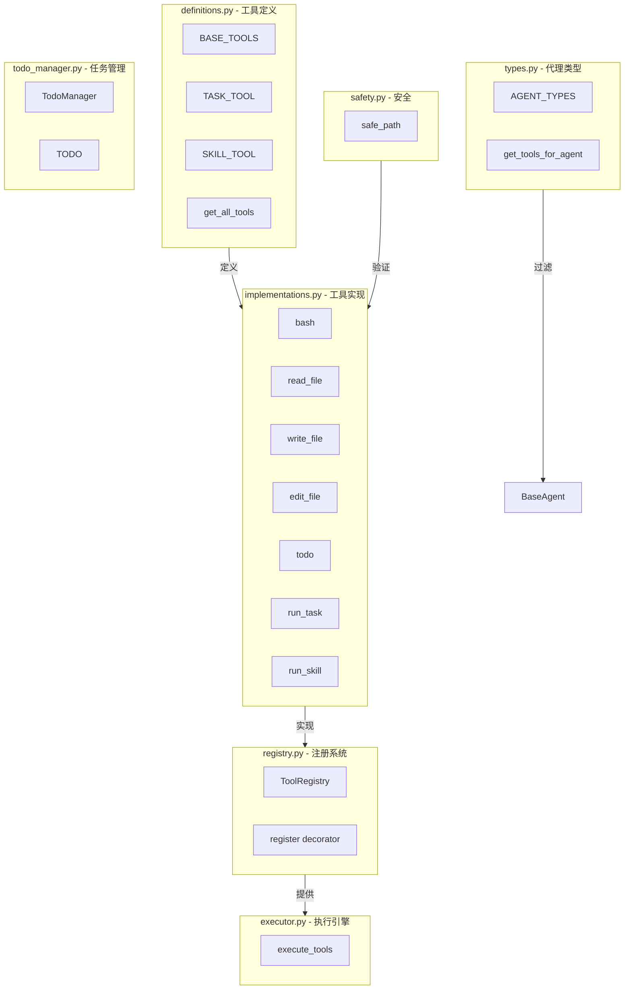
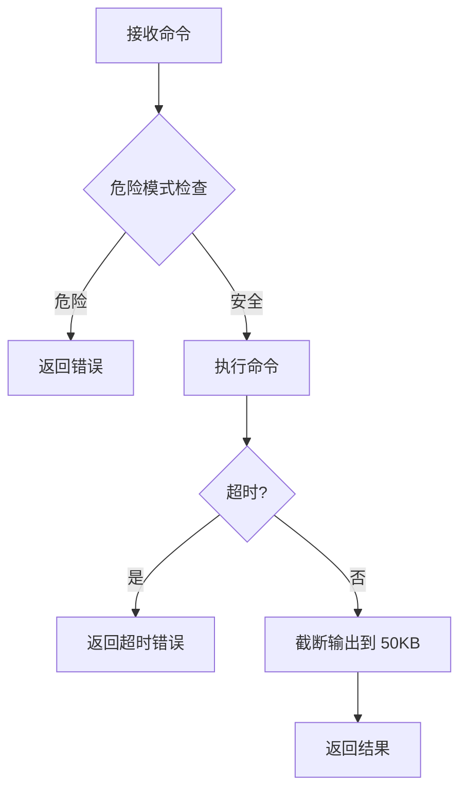
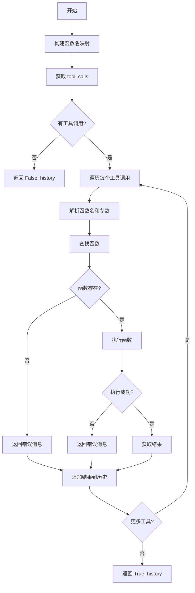
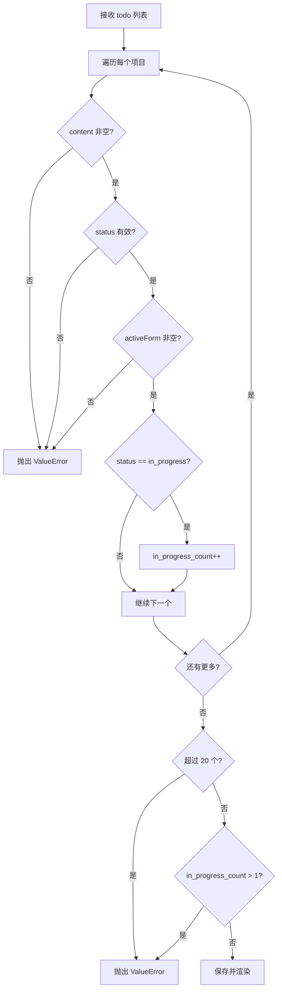
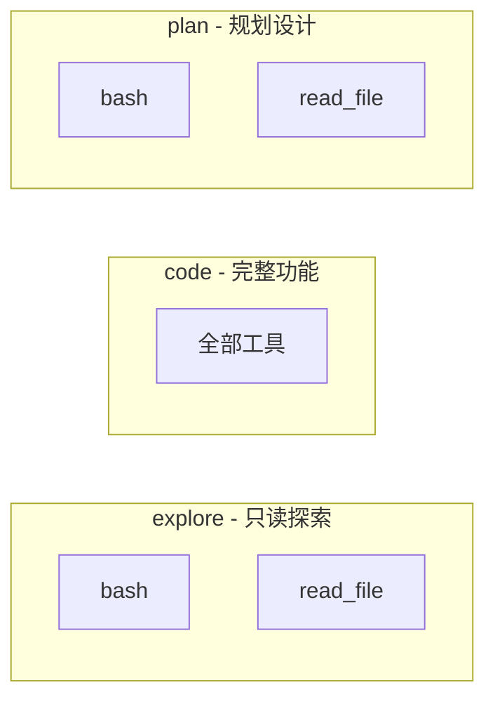
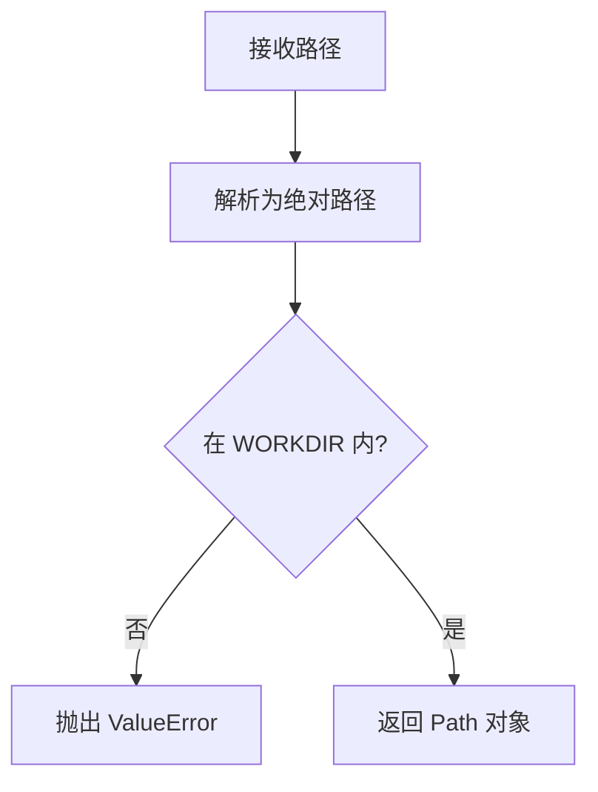
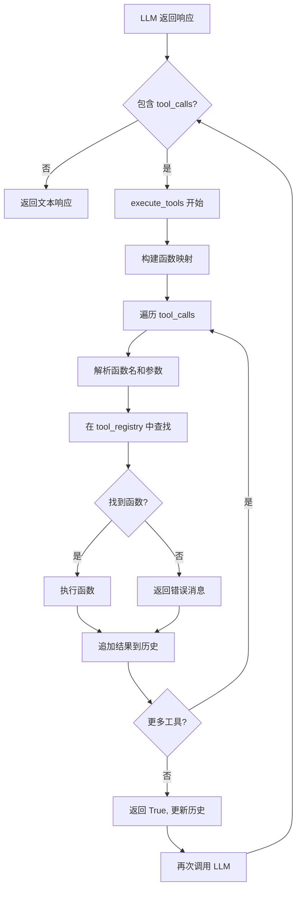

# Tools 模块文档

## 概述

Tools 模块是 `mini_agent` 框架的工具系统，负责工具定义、实现、执行和安全验证。该模块采用 OpenAI Function Calling 格式，支持可扩展的工具注册机制。

## 模块结构

```
tools/
├── definitions.py    # 工具定义（OpenAI Function Calling 格式）
├── implementations.py # 工具实现函数
├── executor.py       # 工具执行引擎
├── todo_manager.py   # Todo 任务管理
├── types.py         # 代理类型定义
├── safety.py        # 路径安全验证
├── registry.py      # 工具注册系统
└── __init__.py      # 模块导出
```

## 架构概览



## 核心组件

### 1. 工具定义 (definitions.py)

#### 基础工具 (BASE_TOOLS)

| 工具名 | 描述 | 参数 |
|--------|------|------|
| `bash` | 执行 shell 命令 | `command` (str) |
| `read_file` | 读取文件内容 | `path` (str), `limit` (int, 可选) |
| `write_file` | 写入文件内容 | `path` (str), `content` (str) |
| `edit_file` | 精确替换文件文本 | `path` (str), `old_text` (str), `new_text` (str) |
| `todo` | 更新 todo 列表 | `items` (List[Dict]) |

#### 扩展工具

| 工具名 | 描述 | 可用性 |
|--------|------|--------|
| `run_task` | 生成子代理处理子任务 | 仅主代理 |
| `run_skill` | 按需加载领域知识技能 | 所有代理 |

### 2. 工具实现 (implementations.py)

#### bash(command: str) -> str

执行 shell 命令，具有以下安全特性：

**安全检查：**
- 使用正则表达式模式匹配检测危险命令
- 阻止根目录删除 (`rm -rf /`)
- 阻止系统关机/重启命令
- 阻止用户管理操作
- 阻止包卸载操作
- 阻止服务停止操作
- 阻止磁盘擦除操作

**其他限制：**
- 超时时间：60 秒
- 输出截断：50KB
- 工作目录：受 workspace 限制



#### read_file(path: str, limit: Optional[int] = None) -> str

读取文件内容，可选行数限制。

**安全特性：**
- 路径通过 `safe_path()` 验证
- 输出截断到 50KB

#### write_file(path: str, content: str) -> str

写入文件内容，创建必要的父目录。

**安全特性：**
- 路径通过 `safe_path()` 验证

#### edit_file(path: str, old_text: str, new_text: str) -> str

精确替换文件中的文本。

**特点：**
- 使用精确字符串匹配
- 仅替换首次出现（防止意外批量修改）
- 如果文本未找到则报错

#### run_task(description: str, prompt: str, agent_type: str) -> str

生成子代理处理子任务。

**代理类型：**
- `explore`: 只读探索
- `code`: 完整编码
- `plan`: 规划设计

#### run_skill(skill_name: str) -> str

加载技能并注入对话。

**关键设计：**
- 技能内容作为 tool_result（用户消息）注入
- 不修改系统提示词（保持 prompt cache）

```mermaid
flowchart LR
    A[调用 run_skill] --> B[获取技能内容]
    B --> C{技能存在?}
    C -->|否| D[返回错误]
    C -->|是| E[包装在 <skill-loaded> 标签中]
    E --> F[返回给 LLM]
    F --> G[模型"知道"如何执行任务]
```

### 3. 工具执行引擎 (executor.py)

#### execute_tools(history, response_message, tool_funcs) -> (bool, List)

执行 LLM 返回的所有工具调用并维护历史。

**参数：**
- `history`: 对话历史
- `response_message`: LLM 响应消息
- `tool_funcs`: 可调用的工具函数列表

**返回：**
- `has_more_tools`: 是否执行了工具
- `updated_history`: 更新后的历史

**流程：**



### 4. Todo 任务管理 (todo_manager.py)

#### TodoManager 类

管理结构化的任务列表，具有强制约束。

**约束规则：**
1. 最多 20 个任务项
2. 同时只能有一个 `in_progress` 任务
3. 每项必须包含：`content`, `status`, `activeForm`

**任务状态：**
- `pending`: 待处理
- `in_progress`: 进行中（同时只能有一个）
- `completed`: 已完成

**Todo 项格式：**

```python
{
    "content": "Task description",
    "status": "in_progress",
    "activeForm": "Doing the task..."
}
```

**渲染格式：**

```
[x] Completed task
[>] In progress task <- Doing something...
[ ] Pending task

(2/3 completed)
```

#### 验证流程



### 5. 代理类型 (types.py)

#### AGENT_TYPES 配置



| 代理类型 | 描述 | 工具 | 系统提示词 |
|----------|------|------|------------|
| `explore` | 只读探索代理 | `bash`, `read_file` | 搜索和分析，不修改文件 |
| `code` | 完整功能代理 | 全部工具 (`*`) | 高效实现请求的更改 |
| `plan` | 规划代理 | `bash`, `read_file` | 分析代码库并输出实施计划 |

### 6. 路径安全 (safety.py)

#### safe_path(p: str) -> Path

确保路径保持在工作空间内。

**安全检查：**
- 解析相对路径
- 阻止通过 `../` 逃逸



### 7. 工具注册系统 (registry.py)

#### ToolRegistry 类

提供装饰器模式的工具注册机制。

**主要方法：**

| 方法 | 返回值 | 描述 |
|------|--------|------|
| `register(name)` | Callable | 注册装饰器 |
| `get(name)` | Callable | 获取工具函数 |
| `list_names()` | List[str] | 获取所有工具名称 |
| `get_all_functions()` | List[Callable] | 获取所有工具函数 |
| `get_function_map()` | Dict[str, Callable] | 获取完整映射 |
| `clear()` | None | 清空注册表 |

**使用示例：**

```python
registry = ToolRegistry()

@registry.register()
def my_tool(arg: str) -> str:
    return f"Processed: {arg}"

@registry.register("custom_name")
def another_tool(x: int, y: int) -> int:
    return x + y

# 获取工具
func = registry.get("my_tool")
print(func("hello"))  # "Processed: hello"

# 列出所有工具
print(registry.list_names())  # ["my_tool", "custom_name"]
```

## 工具调用完整流程



## 使用示例

### 使用基础工具

```python
from src.tools import (
    bash, read_file, write_file, edit_file, todo
)

# 执行命令
output = bash("ls -la")
print(output)

# 读取文件
content = read_file("src/agent/core.py")

# 写入文件
write_file("test.py", "print('hello')")

# 编辑文件
edit_file("test.py", "hello", "world")

# 更新 todo
todo([
    {
        "content": "Read the file",
        "status": "completed",
        "activeForm": "Reading the file..."
    },
    {
        "content": "Write tests",
        "status": "in_progress",
        "activeForm": "Writing unit tests..."
    }
])
```

### 注册自定义工具

```python
from src import BaseAgent

agent = BaseAgent()

@agent.register_tool()
def calculate(expression: str) -> str:
    """安全地计算数学表达式。"""
    try:
        # 限制可用的函数和操作符
        allowed = {"+", "-", "*", "/", "**", "(", ")"}
        if not all(c in allowed or c.isdigit() or c.isspace() for c in expression):
            return "Error: Invalid characters"
        result = eval(expression, {"__builtins__": {}}, {})
        return str(result)
    except Exception as e:
        return f"Error: {e}"

# 使用自定义工具
response = agent.run("Calculate 2 * (3 + 4)")
print(response)  # "14"
```

### 获取代理可用工具

```python
from src.tools import get_tools_for_agent, BASE_TOOLS

# 获取 explore 代理的工具
explore_tools = get_tools_for_agent("explore", BASE_TOOLS)
print([t["function"]["name"] for t in explore_tools])
# Output: ["bash", "read_file"]

# 获取 code 代理的工具
code_tools = get_tools_for_agent("code", BASE_TOOLS)
print([t["function"]["name"] for t in code_tools])
# Output: ["bash", "read_file", "write_file", "edit_file", "todo"]
```

## 安全注意事项

1. **路径验证**：所有文件操作都通过 `safe_path()` 验证，防止访问 workspace 外的文件
2. **命令过滤**：`bash` 工具使用正则表达式检测危险命令模式
3. **超时限制**：命令执行有 60 秒超时
4. **输出限制**：命令和文件输出都限制在 50KB 以内
5. **精确编辑**：`edit_file` 只替换首次出现，防止意外批量修改
6. **子代理隔离**：SubAgent 无法访问父代理历史或生成更多子代理
